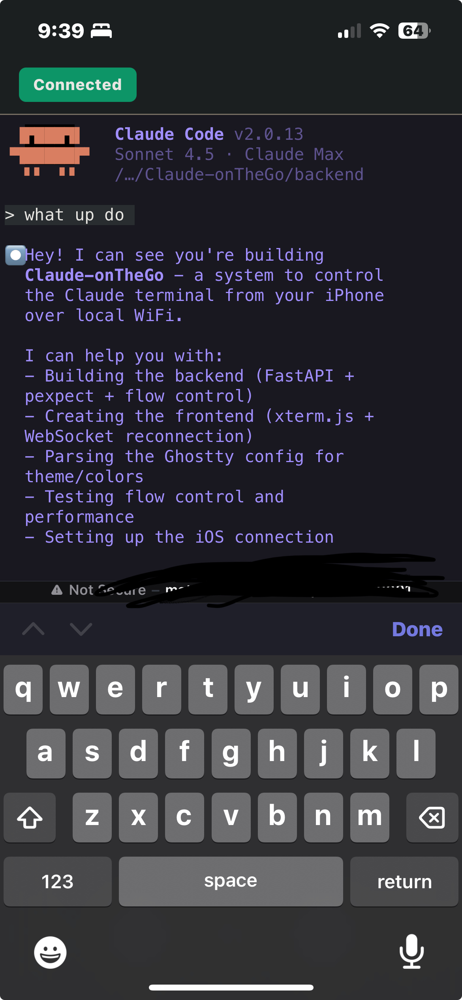

# Claude-on-the-go

> Control your Mac's `claude` CLI from your phone. Because sometimes you just want to code from the couch.

Use Claude on your iPhone, Android, or any device with a browser - while your Mac does the heavy lifting. No cloud sync, no data leaks, just your local network keeping things fast and private.


## 📱 What Is This?

claude-on-the-go lets you use the [Claude Code CLI](https://claude.ai/download) from your mobile device. Your Mac runs the `claude` process, and your phone displays the terminal over WiFi.



**Perfect for:**
- 🛏️ Coding from bed without lugging your laptop
- ⚡ Quick fixes while away from your desk
- 🎉 Showing off Claude to friends on your phone
- 🎨 Actually using that sweet terminal theme you spent hours configuring😅

## 🚀 Quick Start

### ⚙️ One-Command Installation

```bash
git clone https://github.com/MatthewJamisonJS/claude-on-the-go.git
cd claude-on-the-go
./install.sh
```

The installer will:
- ✅ Check for Python 3 and Claude CLI
- 📦 Create a virtual environment
- 🔌 Install dependencies
- 🔒 Run security checks
- ⚙️ Create configuration file

### 🎬 Launch

```bash
./start.sh
```

📲 You'll see a beautiful QR code - scan it with your phone's camera and you're connected!

## 📋 Requirements

**🖥️ Mac/Linux:**
- 🐍 Python 3.8+
- 🤖 [Claude Code CLI](https://claude.ai/download) installed
- 📡 Same WiFi network for Mac and phone

**📱 Mobile Device:**
- 🌐 Any modern browser (Safari, Chrome, Firefox, etc.)
- 📡 Same WiFi network as your Mac

## ✨ Features

### 🔒 Security First
- 🚦 Rate limiting to prevent DoS attacks (10 msg/sec, 100KB/sec)
- ✅ Input validation and sanitization
- 🛡️ Content Security Policy (CSP) headers
- 🔐 Log redaction for sensitive data
- 🎫 Optional token authentication
- 🚫 No hardcoded IPs or ports

### 💾 Session Persistence
- 🔄 Sessions survive disconnections and reconnect seamlessly
- 🆔 UUID-based session IDs with 1-hour timeout
- 🧹 Automatic session cleanup
- ⏮️ Resume coding exactly where you left off

### 📋 Bidirectional Clipboard Sync
- 🖥️→📱 Copy on Mac → automatically syncs to phone
- 📱→🖥️ Copy on phone → automatically syncs to Mac
- ⚡ Configurable sync interval (default 1 second)
- 🔄 Content hashing prevents sync loops
- ⚙️ Can be disabled via config

### 🖥️ Universal Terminal Support

Fully implemented parsers:
- **✅ Ghostty** - Complete theme and font parsing
- **✅ iTerm2** - Binary plist with RGB color extraction
- **✅ Alacritty** - YAML config with multiple file support
- **✅ Kitty** - Key-value config with include directives
- **✅ Terminal.app** - NSColor/NSFont parsing (best-effort)

Partial support (default theme fallback):
- ⏳ Warp
- ⏳ Hyper
- ⏳ Windows Terminal

🎨 Can't find your terminal? Uses a clean default theme.

### 📱 Mobile Optimized
- 📐 Responsive terminal sizing
- 📲 iOS safe area support (handles notch/home indicator)
- 🌊 Smooth scrolling with momentum
- ⌨️ Keyboard-aware layout
- 🌍 Works on ANY phone browser
- 📋 Real-time clipboard sync with your Mac

### 🏭 Production Ready
- ⏱️ 60-minute stability testing with live metrics
- 🔍 Memory leak detection and monitoring
- 📊 CPU and latency tracking
- 🚨 Error rate monitoring
- 📈 Stability scoring (90+/100 passing criteria)

## How It Works

```
┌─────────────────┐         WiFi         ┌─────────────────┐
│  Your iPhone    │◄──────────────────────│  Your Mac       │
│                 │                       │                 │
│  [Safari/Chrome]│    WebSocket (8000)   │  Claude Process │
│  Frontend (8001)│◄──────────────────────│  Backend (8000) │
│                 │                       │                 │
│  xterm.js       │                       │  pexpect + PTY  │
│  renders        │                       │  controls       │
│  terminal       │                       │  claude CLI     │
└─────────────────┘                       └─────────────────┘
```

1. **Backend** (Python + FastAPI) spawns `claude` CLI
2. **Frontend** (HTML + xterm.js) renders terminal
3. **WebSocket** streams I/O between them
4. **mDNS** lets you use `.local` domains (no IP addresses!)

## Configuration

Edit `.env` to customize (all optional):

```bash
# Security
ENABLE_AUTH=true                # Require token authentication
AUTH_TOKEN=your-secret-token    # Set your auth token

# Network
BACKEND_PORT=8000               # Backend WebSocket port
FRONTEND_PORT=8001              # Frontend HTTP port

# Rate Limiting
RATE_LIMIT_MESSAGES=10          # Max messages per second
RATE_LIMIT_BYTES=100000         # Max bytes per second

# Logging
LOG_LEVEL=INFO                  # DEBUG, INFO, WARNING, ERROR
LOG_REDACTION=true              # Redact IPs/tokens from logs

# Features
ENABLE_CLIPBOARD_SYNC=true      # Enable clipboard synchronization
CLIPBOARD_SYNC_INTERVAL=1.0     # Clipboard check interval (seconds)
```

## 🔧 Troubleshooting

### ❌ "Claude CLI not found"

📥 Install it from [https://claude.ai/download](https://claude.ai/download)

### 🚫 "Can't connect from phone"

1. ✅ Make sure you're on the same WiFi network
2. 🔗 Try the direct IP URL instead of `.local`
3. 🔥 Check firewall settings on your Mac

### 🎨 "Terminal looks weird"

🔍 Your terminal config wasn't detected. To add support:
1. 📖 Check `docs/ADDING_TERMINALS.md`
2. 🎯 Or just use the default theme (it's pretty good!)

### ⚠️ "Connection keeps dropping"

📝 Check `backend.log` and `frontend.log` for errors:

```bash
tail -f backend.log
tail -f frontend.log
```

## Documentation

- `docs/SECURITY.md` - Security policy and best practices
- `docs/ADDING_TERMINALS.md` - How to add new terminal parsers
- `docs/LESSONS_LEARNED.md` - Technical deep dive

## Architecture Highlights

**Backend:**
- FastAPI with native WebSockets
- Pexpect for PTY control
- Watermark flow control (pause at 100KB, resume at 10KB)
- Message batching (30ms window)
- Single-user mode (auto-closes old connections)
- Session persistence with UUID-based IDs
- Clipboard monitoring with change detection (pbcopy/pbpaste)

**Frontend:**
- Xterm.js 5.3+
- DOM renderer on mobile (better ANSI support)
- Canvas renderer on desktop (better performance)
- Exponential backoff reconnection (1s→30s with jitter)
- Auto-reconnects to existing sessions

**Security:**
- Token bucket rate limiting (10 msg/sec, 100KB/sec)
- Input size limits (10KB per message)
- Terminal size validation (1-500 rows/cols)
- CSP, X-Frame-Options, X-XSS-Protection headers
- Constant-time auth token comparison
- Log redaction for IPs, tokens, emails

**Terminal Parsers:**
- Ghostty: Key-value config parsing
- iTerm2: Binary plist with RGB float conversion
- Alacritty: YAML config with multi-file support
- Kitty: Key-value with include directives
- Terminal.app: NSColor/NSFont heuristic parsing

## Contributing

PRs welcome! Especially for:
- New terminal parsers (see `docs/ADDING_TERMINALS.md`)
- Bug fixes
- Documentation improvements
- Performance optimizations

Please read `SECURITY.md` before contributing.

## License

MIT License - see `LICENSE` file

Built for vibecoders who want Claude in their pocket.

## Acknowledgments

- [Anthropic](https://anthropic.com) for Claude
- [xterm.js](https://xtermjs.org/) for terminal emulation
- [FastAPI](https://fastapi.tiangolo.com/) for the web framework

---

## Questions or Issues?

**Found a bug or have a question?**
Open an issue: https://github.com/MatthewJamisonJS/claude-on-the-go/issues

**Security concern?**
Report privately: https://github.com/MatthewJamisonJS/claude-on-the-go/security/advisories/new
(This creates a private report that only maintainers can see)

**Want to add a terminal parser?**
Check out: `docs/ADDING_TERMINALS.md`
